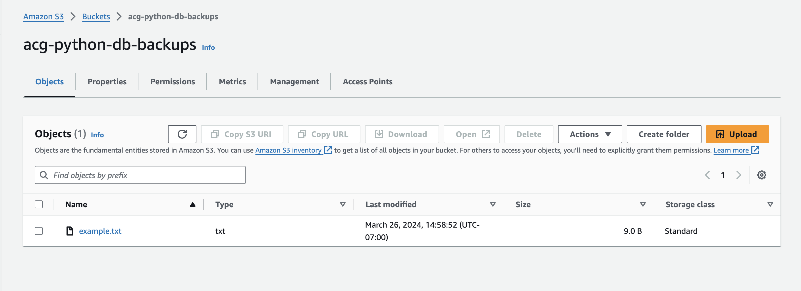

# pgbackup

A CLI for backing up remote PostgreSQL databases locally or to AWS S3.

```
pgbackup posgtres://username@ip:port/db_name --driver local /path/to/file
```

## Usage

Pass in a full database URL, the storage driver, and destination.

S3 Example w/ bucket name:

```
$ pgbackup postgres://bob@example.com:5432/db_one --driver s3 backups
```

Local Example w/ local path:

```
$ pgbackup postgres://bob@example.com:5432/db_one --driver local /var/local/db_one/backups
```

## Installation From Source

To install the package after you've cloned the repository, you'll want to run the following command from within the project directory:

```
$ pip install --user -e .
```

## Preparing for Development

Follow these steps to start developing with this project:

1. Ensure `pip` and `pipenv` are installed
2. Clone repository: `git clone git@github.com:example/pgbackup`
3. `cd` into the repository
4. Activate virtualenv: `pipenv shell`
5. Install dependencies: `pipenv install`

git ignore from `https://github.com/github/gitignore`

Handling arguments and flags:

`https://docs.python.org/3/library/argparse.html`
`https://acloudguru-content-attachment-production.s3-accelerate.amazonaws.com/1606848446436-CHAPTER%2010.1%20Project%20Setup.txt`

## utilizing backup with simple example.txt file:



## installing pgbackup package for cli usage I created:


## testing cli package for local dump functions:


## Invocation of the S3 cli command of my package works, also S3 picture showing the example SQL file with 1,000 rows:


## backup working before setting timestamp:


## backup to S3 working with timestamp of filename:


# use wheel to distribute the package


